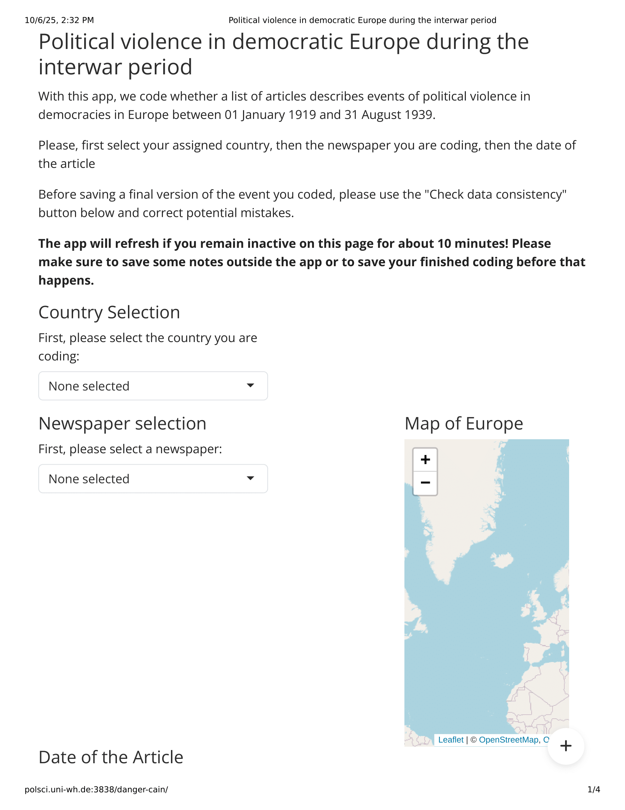
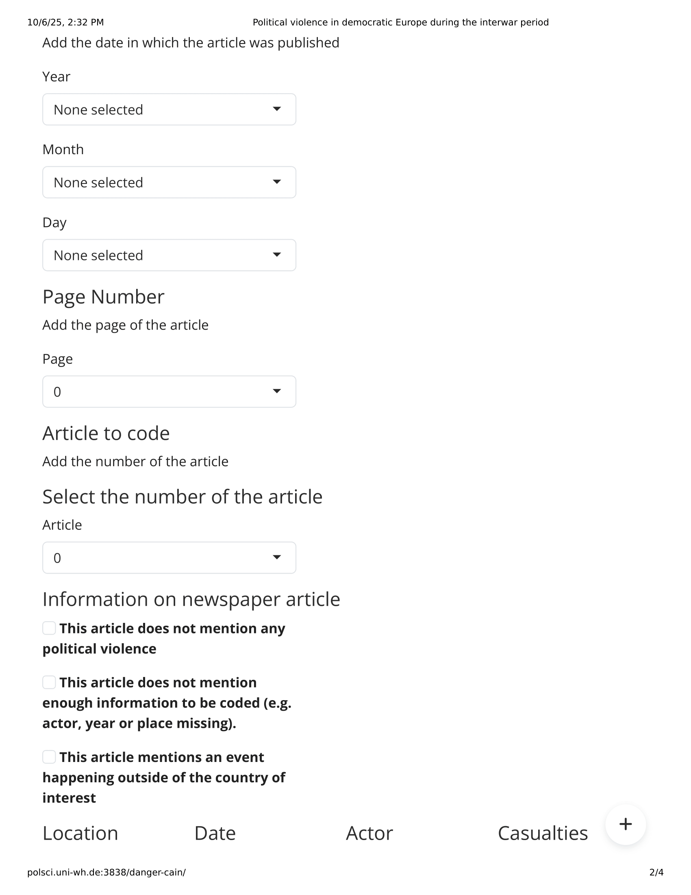
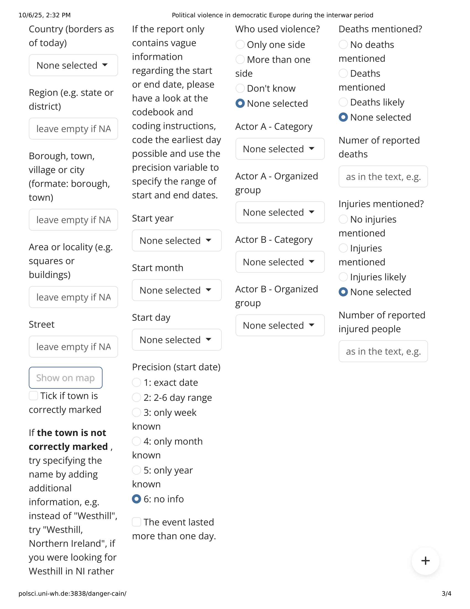
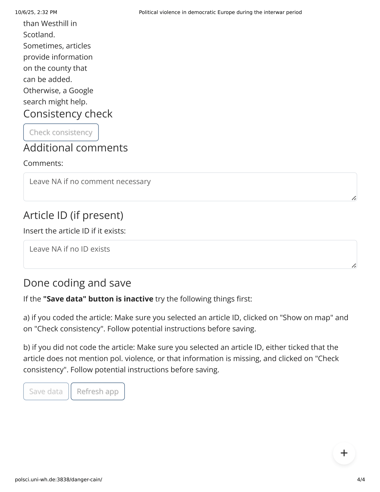

This is a ShinyAPP created to automate data collection for coding political violence within the European Research Council-funded "Danger" project in October 2023.
The script creates an app through which trained coders were coding political violence events for our ERC project. We were then able to automatically collect new data as they submit their codings.
Here is the link to the app: http://polsci.uni-wh.de:3838/danger-cain/

Below are the pictures of the interface:

